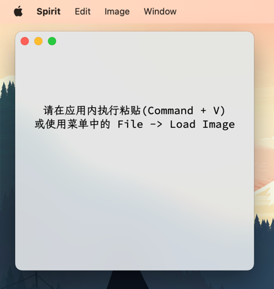
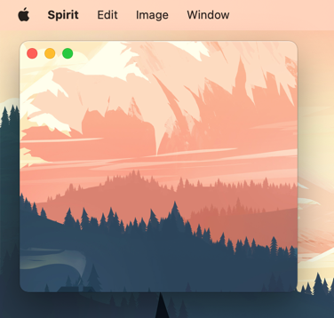

Spirit
===============

使用 go 语言开发的，从剪切板或本地图片获取图片并悬浮到桌面的小工具

### 默认页面

鼠标移入应用顶部，自动出现窗口拖动区域

### 悬浮效果

可使用 File -> Clean 清除当前展示的图片

## 致谢

- GUI 框架： https://github.com/wailsapp/wails
- App 图标： https://github.com/twitter/twemoji
- 应用界面字体：
    - https://github.com/lxgw/LxgwWenkaiGB
    - https://github.com/adobe-fonts/source-code-pro
